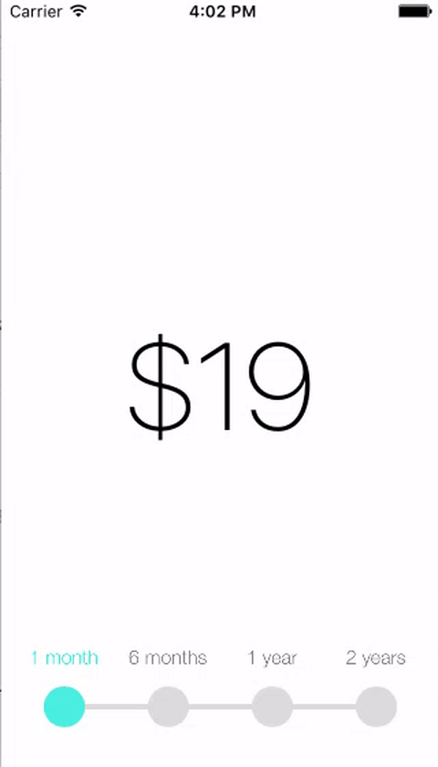
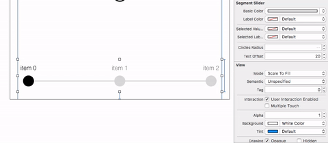

# MMSegmentSlider

[](https://cocoapods.org/pods/MMSegmentSlider)
[](https://github.com/MedvedevMax/MMSegmentSlider/blob/master/LICENSE)
[](https://cocoapods.org/pods/MMSegmentSlider)
[](https://github.com/Carthage/Carthage)
[](https://travis-ci.org/MedvedevMax/MMSegmentSlider)

`MMSegmentSlider` is an easy-to-use IBDesignable animated slider for iOS 7+ written in Objective-C.



## Installation

### From CocoaPods

[CocoaPods](http://cocoapods.org) is a dependency manager for Objective-C, which automates and simplifies the process of using 3rd-party libraries like `MMSegmentSlider` in your projects. First, add the following line to your [Podfile](http://guides.cocoapods.org/using/using-cocoapods.html):

```ruby
pod 'MMSegmentSlider'
```

If you want to use the latest features of `MMSegmentSlider` use normal external source dependencies.

```ruby
pod 'MMSegmentSlider', :git => 'https://github.com/MedvedevMax/MMSegmentSlider'
```

This pulls from the `master` branch directly.

Second, install `MMSegmentSlider` into your project:

```ruby
pod install
```

### Carthage 

[Carthage](https://github.com/Carthage/Carthage) is a decentralized dependency manager that builds your dependencies and provides you with binary frameworks.

You can install Carthage with [Homebrew](http://brew.sh/) using the following command:

```bash
$ brew update
$ brew install carthage
```

To integrate `MMSegmentSlider` into your Xcode project using Carthage, specify it in your `Cartfile`:

```ogdl
github "MedvedevMax/MMSegmentSlider"
```

Run `carthage update` to build the framework and drag the built `MMSegmentSlider.framework` (in Carthage/Build/iOS folder) into your Xcode project (Linked Frameworks and Libraries in `Targets`).


### Manually

* Drag the `MMSegmentSlider` folder into your project.
* Enjoy it

## Usage

(see sample Xcode project in `/demo`)

`MMSegmentSlider` is completely **IBDesignable** and **IBInspectable**. This means you can customise it right in the Interface Builder and see the changes immediately.



### Interface Builder

The simplest way to use MMSegmentSlider is to add an empty view and set the class to MMSegmentSlider. Then you can customise its appearance right in the Attribute Inspector.
Though you should note that the font for labels can only be customised from the code:
```objective-c
segmentSlider.labelsFont = [UIFont fontWithName:@"HelveticaNeue-Light" size:14.0f];
```

### Using the code

You can also instantiate MMSegmentSlider like any other UIControl right from the code and use the following properties to change the look of the slider:

```objective-c
@property (nonatomic, strong) UIColor *basicColor;
@property (nonatomic, strong) UIColor *labelColor;
@property (nonatomic, strong) UIColor *selectedValueColor;
@property (nonatomic, strong) UIColor *selectedLabelColor;
@property (nonatomic) NSInteger circlesRadius;
@property (nonatomic) NSInteger textOffset;
@property (nonatomic, strong) UIFont *labelsFont;
```

### Values and labels

To set values for items use:
```objective-c
segmentSlider.values = @[@"$19", @"$99", @"$199", @"$299"];
```

This values are not visible and will only be returned when you retrieve the selected value:
```objective-c
priceLabel.text = (NSString *)segmentSlider.currentValue;
```

To set labels for these values use:
```objective-c
segmentSlider.labels = @[@"1 month", @"6 months", @"1 year", @"2 years"];
```

You can also get the index of the selected item using the following property:
```objective-c
@property (nonatomic) NSInteger selectedItemIndex;
```

Note that it's not readonly, so you can change current value using it. If you want to animate changing use this method instead:
```objective-c
- (void)setSelectedItemIndex:(NSInteger)selectedItemIndex animated:(BOOL)animated;
```

## License

`MMSegmentSlider` is distributed under the terms and conditions of the [MIT license](https://github.com/MedvedevMax/MMSegmentSlider/blob/master/LICENSE).

## Credits

`MMSegmentSlider` is brought to you by [Max Medvedev](https://twitter.com/max_medvedev). If you're using `MMSegmentSlider` in your project, attribution would be very appreciated.

